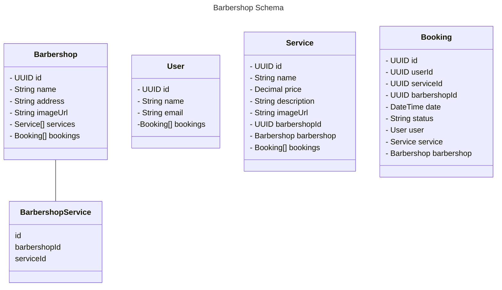

## Diagrama de Classes

## ANOTAÇÕES

https://narrow-beach-a00.notion.site/Primeira-Aula-aa69a34ccda9486ea0d544a804140e68

### Prisma Commands
    npm install prisma --save-dev  

    npx prisma init --datasource-provider postgresql

    npx prisma format

    npx prisma migrate dev --name add_initial_tables

    npx prisma studio 

## 
conventional commits

 npm install -D ts-node 

npx prisma db seed  

--------------------------------
shadcn/ui

npx shadcn-ui@latest init

npx shadcn-ui@latest add card
npx shadcn-ui@latest add button
